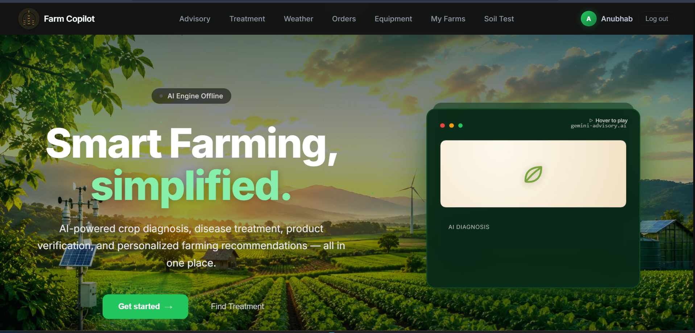
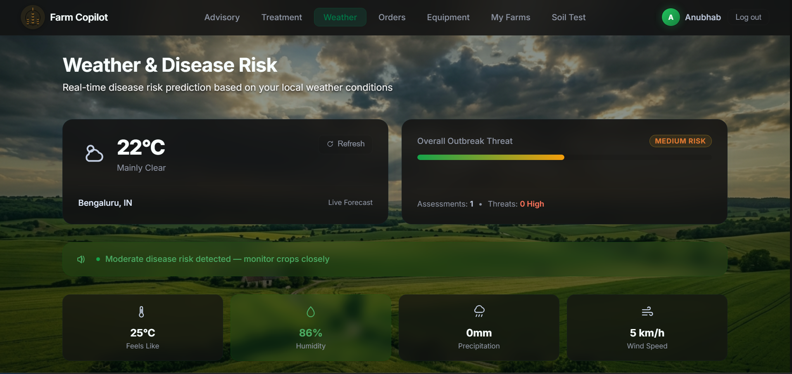
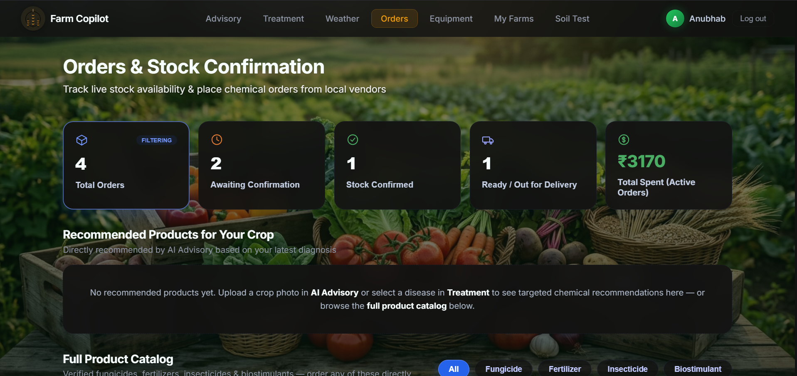

<div align="center">

# 🌾 Farm Copilot

### Smart Farming, Simplified.

AI-powered crop diagnosis, disease treatment, product ordering, and personalized farming recommendations — all in one place.


</div>

---

## 🖥️ Preview

<div align="center">

</div>

<br/>

<table>
<tr>
<td width="50%"></td>
<td width="50%"></td>
</tr>
<tr>
<td align="center"><b>Weather & Disease Risk</b></td>
<td align="center"><b>Orders & Stock Confirmation</b></td>
</tr>
</table>

---

## 📖 Table of Contents

- [About](#-about)
- [Features](#-features)
- [Tech Stack](#️-tech-stack)
- [Project Structure](#-project-structure)
- [Getting Started](#️-getting-started)
- [How It Works](#-how-it-works)
- [Contributors](#-contributors)
- [License](#-license)

---

## 🌱 About

**Farm Copilot** is a full-stack platform built to help farmers make smarter, faster decisions. It brings together AI-powered crop diagnosis, multilingual advisory, disease treatment recommendations, real-time weather and outbreak-risk forecasting, a vendor/equipment marketplace, and IoT-based soil health monitoring — all in a single, easy-to-use dashboard.

---

## ✨ Features

### 🩺 AI Advisory
- Upload a photo of your crop **or** simply ask a question — get instant AI-generated guidance.
- Available in **11 regional languages**, so language is never a barrier.
- Detects crop diseases directly from uploaded images.

### 💊 Treatment
- Once a disease is detected, get targeted treatment recommendations.
- Shows agri-shops and vendors stocking the required treatment **within a 10 km radius**, so farmers can act quickly.

### 🌦️ Weather & Disease Risk
- **Real-time weather forecasting**, auto-detected using the farmer's live location.
- Live conditions: temperature, "feels like," humidity, precipitation, and wind speed.
- **AI-driven outbreak risk score** (Low / Medium / High) predicting disease risk based on current weather patterns, with spoken/visual alerts (e.g. *"Moderate disease risk detected — monitor crops closely"*).

### 🛒 Orders & Stock Confirmation
- Track live stock availability and place orders for chemicals, fertilizers, insecticides, and biostimulants from local vendors.
- Order status pipeline: **Awaiting Confirmation → Stock Confirmed → Ready / Out for Delivery**.
- **AI-recommended products** — after a crop diagnosis or treatment selection, the AI suggests exactly which products to order.
- Full searchable product catalog, filterable by category.
- Tracks total spend across active orders.

### 🚜 Equipment Rental
- Browse and rent farming equipment and machinery from nearby vendors.

### 📍 Nearby Shops & Vendors
- Interactive map showing nearby agricultural agencies, fertilizer/chemical shops, and equipment vendors.
- Each listing includes name, address, rating, and distance, with a direct Google Maps link.

### 🧪 Soil Test (NPK Hardware Integration)
- Connect a physical **NPK meter** via USB/serial (baud rate configurable) for live sensor readings, or enter values manually / load a demo reading.
- Reads full nutrient profile: **Nitrogen, Phosphorus, Potassium**, and other key soil parameters.
- **AI analysis of soil results** — interprets nutrient readings and gives recommendations tailored to the crop being grown.
- Saved tests build a historical soil profile per farm, enabling trend analysis over time.

### 🗺️ My Farms
- Manage multiple farms, each with its own location, address, and assigned crop.

---

## 🛠️ Tech Stack

<div align="center">

| Layer | Technologies |
|---|---|
| **Frontend** | React (Vite), TypeScript, Tailwind CSS, ESLint |
| **Backend** | Node.js, Express |
| **Hardware** | NPK soil nutrient sensor/meter (serial/USB) |
| **Integrations** | Maps API (vendor discovery), Live Weather API (geolocation-based), AI/ML models (crop disease detection, multilingual advisory, soil analysis) |

</div>

---

## 📁 Project Structure

```
├── backend/          # API and server logic
├── frontend/          # React + Vite client
│   ├── public/
│   ├── src/
│   └── ...
├── guide.md
└── copilot.md
```

---

## ⚙️ Getting Started

### Prerequisites
- Node.js (v18+ recommended)
- npm

### Installation

```bash
# 1. Clone the repository
git clone https://github.com/Anubhabcysec/<repo-name>.git
cd <repo-name>

# 2. Install & run frontend
cd frontend
npm install
npm run dev

# 3. Install & run backend (in a separate terminal)
cd backend
npm install
npm start
```

---

## 🧑‍🌾 How It Works

1. 🗺️ A farmer adds farm details (location, crop) under **My Farms**.
2. 🩺 Under **Advisory**, they upload a crop photo or ask a question in their preferred language (11 supported) — AI diagnoses the crop and responds with guidance.
3. 💊 If a disease is detected, **Treatment** shows recommended treatment steps along with nearby vendors (within 10 km) that stock what's needed.
4. 🌦️ **Weather** auto-detects the farmer's location and shows live conditions plus an AI-predicted disease outbreak risk score.
5. 🛒 AI-recommended and catalog products can be ordered via **Orders**, with live stock tracking through to delivery; equipment is rented via **Equipment**.
6. 📍 Nearby agri-shops and vendors are visible on an interactive map with ratings, distance, and directions.
7. 🧪 Under **Soil Test**, farmers connect an NPK meter (or enter values manually) to read soil nutrients. The AI analyzes the results and gives crop-specific recommendations, building a soil history per farm over time.

---

## 🤝 Contributors

<a href="https://github.com/Anubhabcysec">
  
</a>

**[Anubhab](https://github.com/Anubhabcysec)**

---

## 📄 License

This project currently has no license specified. Add one (e.g. MIT) if you plan to open-source it.

<div align="center">

Made with 🌾 for farmers.

</div>
